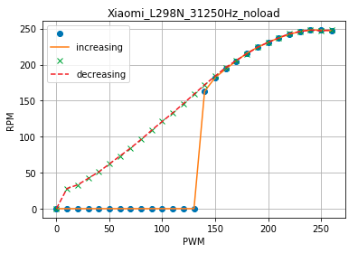
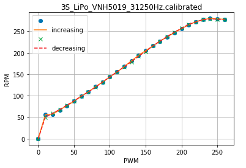

# balancing_rbt

Test codes to make 2-wheel balancing robot using Arduino

## Test codes

#### [Kalman](Kalman)

Kalman filter implementation from [https://github.com/TKJElectronics/KalmanFilter](https://github.com/TKJElectronics/KalmanFilter)

#### [pid_graph](pid_graph)

Processing codes to visualize PID parameters

#### [prj2.1_wheel_control](prj2.1_wheel_control)

control the speed of wheel using PID to reach quickly and accurately at the target speed.

#### [prj2.2_mpu6050](prj2.2_mpu6050)

test MPU6050

#### [prj2.5_distance](prj2.5_distance)

emulate radar using SR04 ultrasonic sensor on top of servo motor

#### [prj2.6_pololu_wheel](prj2.6_pololu_wheel)

motor test using Pololu 25D DC motor, L298N motor driver to get PWM to RPM graph according to PWM frequency and power source.

  

See [motor_test_12V_4A_Adaptor_L298N.ipynb](prj2.6_pololu_wheel/data/motor_test_12V_4A_Adaptor_L298N.ipynb) and [motor_test_Xiaomi_L298N_noload.ipynb](prj2.6_pololu_wheel/data/motor_test_Xiaomi_L298N_noload.ipynb) for the test results.

#### [prj2.7_vnh5019](prj2.7_vnh5019)

motor test using Pololu 25D DC motor, Pololu VNH5019 motor driver to get PWM to RPM graph according to PWM frequency and power source.

  

See [motor_test_3S_LiPo_VNH5019.ipynb](prj2.7_vnh5019/data/motor_test_3S_LiPo_VNH5019.ipynb) and [motor_test_12V_4A_Adaptor_VNH5019.ipynb](prj2.7_vnh5019/data/motor_test_12V_4A_Adaptor_VNH5019.ipynb) for the other test results.

#### [prj3.2_a4988_speedtest](prj3.2_a4988_speedtest)

motor test using stepper motor and A4988 motor driver

## Balancing robot

#### [prj2.3_balancing_0](prj2.3_balancing_0)

Xiaomi phone charger with 12V level converter, DC motor 74 RPM, 84mm wheel, L298N, MPU6050, IR

#### [prj2.8_balancing_2](prj2.8_balancing_2)

3S LiPo battery, DC motor 290 RPM 8.5 kg-cm, VNH5019 motor driver, MPU6050, IR

#### [prj3.1_a4988](prj3.1_a4988)

3S LiPo battery or 12V/4A AC-DC adaptor, NEMA 17 stepper motor, A4988 motor driver, IR

